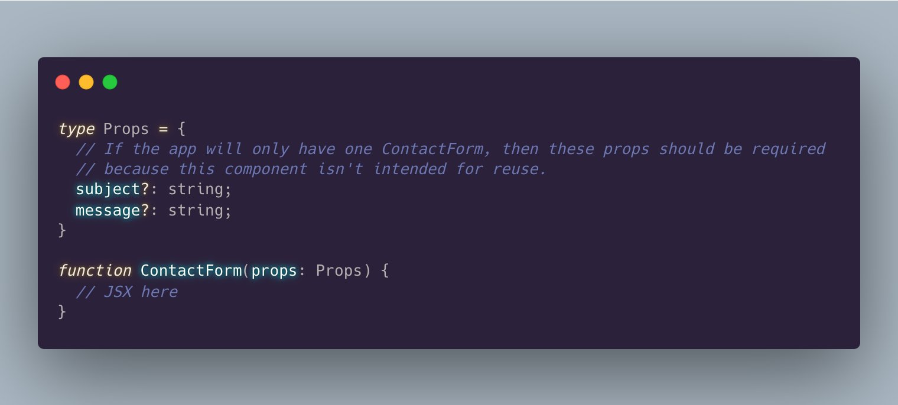

- ```javascript
  console.log('Hello World!');
  ```
- `Hello World!`
- id:: 64cf6c77-b0dd-49a9-bc3a-5591f677ecc7
  #+BEGIN_TIP
  This is a tip for logseq
  #+END_TIP
- # this is a h1 title
- **this is bold text**
- _This is Italics text_
- [# How I Use Logseq to Take Notes and Organize My Life](https://medium.com/my-learning-journal/how-i-use-logseq-to-take-notes-and-organize-my-life-3669a75eb224)
- hello
	- you are welcome!
	- Collapse
	- Expand
- world
- #+BEGIN_NOTE
  this is A note for something
  #+END_NOTE
- id:: 64cf71f5-fd64-46c0-98dc-e9105401fd7b
  ``` java
  public class Main {
    public static void main(String[] args) {
      System.out.println("Hello World!");
    }
  }
  ```
- #+BEGIN_CENTER
  center the text
  #+END_CENTER
- [[Aug 7th, 2023]] {:height 1256, :width 702}
- ((64cf6c77-b0dd-49a9-bc3a-5591f677ecc7))
- #+BEGIN_QUOTE
  React tip: Components designed for a single use should have only required props.
  
  An optional prop for a single use component is illogical. If the prop isn't required for its single use, it shouldn't exist at all.😀
  
  So, only use optional props for reusable components
   
  #+END_QUOTE
- [Logseq Tips](https://facedragons.com/foss/logseq-tips/)
	- Understand Indenting in Logseq(Core function of how logseq works)
		- A stylistic choice
		- Everything is a block in logseq
		- Use **Tab** to indent something
		- You can easily link and reference individual blocks
	- [Logseq Templates Makes You More Efficient](https://facedragons.com/foss/logseq-templates/)
- [logseq-fenced-code-plus](https://github.com/xyhp915/logseq-fenced-code-plus)
	- ```mermaid
	  sequenceDiagram
	  	participant dotcom
	      participant iframe
	      participant viewscreen
	      dotcom->>iframe: loads html w/ iframe url
	      iframe->>viewscreen: request template
	      viewscreen->>iframe: html & javascript
	      iframe->>dotcom: iframe ready
	      dotcom->>iframe: set mermaid data on iframe
	      iframe->>iframe: render mermaid
	  ```
	- [Mermaid.js](https://mermaid.js.org/)
	- To start, simply trigger it using `/Draw mermaid diagram`. Then add your mermaid syntax in the code block and click `Render`
- #+BEGIN_EXPORT latex
  \nabla \times \vec{\mathbf{B}} -\, \frac1c\, \frac{\partial\vec{\mathbf{E}}}{\partial t} = \frac{4\pi}{c}\vec{\mathbf{j}}    \nabla \cdot \vec{\mathbf{E}} = 4 \pi \rho
  #+END_EXPORT
	- [Katex](https://katex.org/docs/support_table)